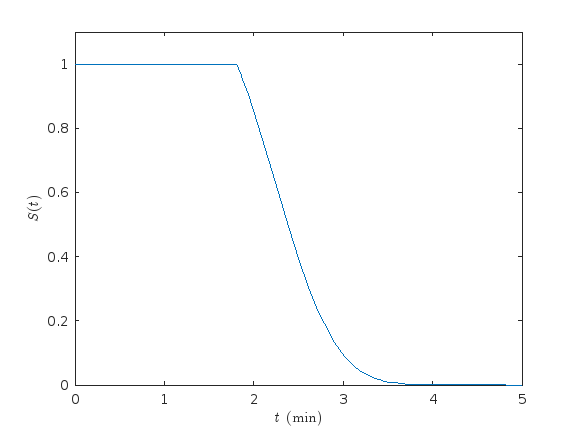

# 
 Microbial Growht :microbe:   Final project of Laboratory of Computational Physics - Mod. B 

**Group members:** Giovanni Zago, Emanuele Sarte, Alessio Saccomani, Fateme  
**Supervisor:** Prof. Carlo Albert  
**Academic year:** 2022/2023

This project has been carried out by a group of Physics of Data student as final project of the course Laboratory of Computational Physics - Mod. B, held by Prof. Marco Baiesi. The subject of the project and the supervision of the work has been provided by Prof. Carlo Albert. 

## Table of contents
1. [Introduction](#introduction)
    1. [Formalism](#formalism)
    2. [Model 1](#model1)
    3. [Model 1.2](#model1.2)
    4. [Model 2](#model2)
    4. [Model 3](#model3)

## Introduction 

The aim of this project is analyzing data coming from microbial coltures by performing Bayesian inference of parameters belonging to stochastic models that describe the growth and the lifetime of the microbes themselves. The datasets used in this work are *Tanouchi25c*, *Tanouchi37c* and *Susman18*. 

### Formalism 
The underlying idea that is shared by all the models considered for the analysis of the data is that a microbe can be described as a *dynamical system* characterized by a few dynamical variables $\vec{x}$ that obey a *"motion" equation*:

$$\dot{\vec{x}} = F(\vec{x}) \tag{1}$$

Clearly, both $\vec{x}$ and $F(\vec{x})$ are specified by the considered model, and thus can vary a lot. For example, a dynamical variable that is common to all the models is the *microbe size* $m$ (with $[m] = \Bbb{L}$), thus by solving eq. (1) one gets how the size of a microbe grows over time. Another importat aspect that must be embedded in a model is the lifetime of a microbe. As a matter of fact, it is evident that $m$ can not become arbitrairly large, since the microbe would divide at a certain moment, generating a daughter cell. However, it is reasonable to think that the time at which the microbe divides is not deterministic, and so its lifespan should be drawn from a *probability distribution*, that, again, can vary according to the considered model. The best way to formalize this is to define a function $S(t)$ called *survival probability* that represents the probability of the microbe cell to survive (i.e. not divide) for $\hat{t} \leq t$. In general the survival probability obeys

$$\frac{\dot{S}(t)}{S(t)} = - h(\vec{x}(t)) \tag{2}$$

where $h(\vec{x})$ is a generic function of the dynamic variables. Since $S(t)$ is a (sort of) cumulative distribudion function then $\dot{S}(t)$ is a probability distribution, and so $t \sim \dot{S}(t)$, with $t \geq 0$, represents, in theory, a possibile lifespan of the cell. This is a key concept because, for example, by collecting data samples of the microbes lifespans we can infer the parameters that describe $\dot{S}(t)$, which are also the parameters that describe $\vec{x}(t)$, allowing us to validate our models.  
Next we are going to showcase the models considered for the Bayesian inference through the project. 

### Model 1 
This first model is very basic and aims to get the essential features that a good model shoud embed to correctly describe the phenomenon we are facing. This model is single-traited, namely

$$\vec{x} \equiv x = m$$

with the microbe size $m$ obeying 

$$\dot{m} = \omega_1 (m + u) \tag{4}$$

In this case eq. (2) holds with

$$h(m) = \omega_2 \Big(1 + \frac{m}{v}\Big) \tag{5}$$

In these equations $\omega_1$ and $\omega_2$ represent two rates (*growth rate* and *division rate* respectively), so $[\omega_1] = [\omega_2] = \Bbb{T} ^ {-1}$ while $u, \, v$, with $[u] = [v] = \Bbb{L}$ represent two parameters that help the model to be more realistic. Another important feature that a model must provide is the conditional distibution that specifies how the microbe traits change after a division. In this model the distribution is

$$\mathcal{J}(m|m') = \delta \Big(m - \frac{m'}{2}\Big) \tag{6}$$

thus

$$m_{after} = \Braket{\mathcal{J}(m|m'), m} = \int m \, \delta \Big(m - \frac{m'}{2}\Big) dm = \frac{m'}{2}$$

By integrating eq. (4) we obtain

$$m(t) = e ^ {\omega_1 t} (m_0 + u) - u \tag{7}$$

that substituted in (5) returns

$$S(t) = \exp \Bigg(\omega_2 t \Big(\frac{u}{v} - 1\Big) - \frac{\omega_2 (m_0 + u)}{w_1 u} \Big(e^{\omega_1 t} - 1\Big)\Bigg) \tag{8}$$

### Model 1.2 
This model is a more accurate version of Model 1, since it embeds the fact that a microbe cell can divide only if a minimum size has been reached. Nevertheless, it is still a single trait model:

$$\vec{x} \equiv x = m$$

with the microbe size $m$ obeying

$$\dot{m} = \omega_1 m \tag{9}$$

Eq. (2) holds also in this case, but now

$$h(m) = \begin{cases} 0 \qquad \qquad m \lt u \\
\omega_2 \frac{m + v}{u + v} \qquad m \geq u\end{cases} \tag{10}$$

and also the expression for $\mathcal{J}(m|m')$ remains unchanged from Model 1. Eq. (9) leads to 

$$m(t) = m_0 e ^ {\omega_1 t} \tag{11}$$

and thus we can define the following quantity

$$t^* \equiv \frac{1}{w_1} \log \Big(\frac{u}{m_0}\Big)$$

which represents the amount of time elapsed since the division of the mother cell in order for $h(m)$ to become non-zero. Now we can integrate eq. (), obtaining 

$$S(t) = 0 \qquad t \lt t^* \tag{12a}$$

$$S(t) = \exp \Big(- \frac{\omega_2}{\omega_1(u+v)}[e ^ {\omega_1 t} - \omega_1 v t  - 1]\Big) \qquad t \geq t^* \tag{12b}$$

Since $m_0$ could be smaller than $u$, then, in those cases, $t^* <0$, meaning that $h(m)$ is non-zero since the start of the daughter microbe's life and $S(t)$ has only the expression reported in eq. (12b). This means that $t=0$ is a valid sample from $\dot{S}(t)%$ and thus istantaneous division is allowed by this model. However, this feature is not realistic, because no obervations of this behaviour has been made on microbes. 

### Model 2 
Model 2 aims at correcting the istantaneous division problem that arises in Model 1.2. To do so we need to introduce another dynamic variable, $p$, which represents the amount of a fictious protein that needs to be accumulated over a certain threshold quantity in order to allow the division process. Thus in this case we have that

$$\vec{x} = \begin{pmatrix} m \\ 
p \end{pmatrix}$$

and

$$\dot{\vec{x}} = \begin{pmatrix} \omega_1 m \\ 
\omega_1 c m \end{pmatrix} \tag{13}$$

The growth rate $\omega_1$ is the same both for the size and the protein amount, which is a reasonable assumption. $c$ represents the protein concentration, which we can set equal to 1 without losing generality. The survival probability equation becomes

$$\frac{\dot{S}(t)}{S(t)} = - h(m,p) \tag{14}$$

with

$$h(m,p) = \begin{cases}0 \qquad \qquad \text{for} \quad p \lt u \\ 
\omega_2 \frac{p + v}{u + v} \qquad \text{for} \quad p \geq u\end{cases} \tag{15}$$

and the division equation becomes

$$\mathcal{J}(m,p | m',p') = \delta(p)\delta\Big(m - \frac{m'}{2}\Big) \tag{16}$$

meaning that the protein amount drops to zero at each cell division, while the microbe size after the division becomes half the one reached at the end of the previous life cycle. By integrating (3) we get

$$m(t) = m_0 e ^ {w_1 t} \tag{17}$$

$$p(t) = m_0 (e ^ {w_1 t} - 1) \tag{18}$$

Thanks to eq. (18) we can look at eq. (15) and define

$$t^* \equiv \frac{1}{\omega_1} \log \Big(\frac{u}{m_0} + 1\Big) \tag{19}$$

which is always a positive quantity. Thus by integrating (15) we get

$$S(t) = 1 \qquad t \lt t^* \tag{20a}$$

$$S(t) = \exp \bigg(- \frac{\omega_2 m_0}{\omega_1 (u + v)} [e ^ {\omega_1 t} + \omega_1 t \Big(\frac{v}{m_0} - 1\Big) - 1]\bigg) \qquad t \geq t^* \tag{20b}$$

from which it is evident that istantaneous division is not allowed.

    <!--  -->
    

### Model 3 

This last model is the more advanced one as it introduces more elements of stochasticity aiming at catching more accurately the observed behaviour of microbe cells. The fist main innovation that this model embeds is the presence of the growth rate as dynamic variable, thus

$$\vec{x} = \begin{pmatrix} m \\ 
p \\
\alpha \end{pmatrix}$$

with

$$\dot{\vec{x}} = \alpha \begin{pmatrix} m \\ 
c m \\
0 \end{pmatrix} \tag{21}$$

The survival probability equation remains the same as (15). So the growth rate does not vary during the lifetime of a microbe, but it may change from one cell cycle to the following. Indeed the division distribution embeds this feature, as well as a variable division factor:

$$\mathcal{J}(m, p, \alpha|m', p', \alpha') = f_{\Gamma}(\alpha) \, \delta(p) \, (f_{\beta} * \delta)(m) = \\
= f_{\Gamma}(\alpha) \, \delta(p) \, 
\int \delta(m - k m') \, f_{\beta}(k) \, dk = f_{\Gamma}(\alpha) \, \delta(p) \, f_{\beta}\Big(\frac{m}{m'}\Big) \, \frac{1}{m'} \tag{22}$$

From eq. (22) we see that after each cell division the a growth rate $\alpha$ is drawn from a gamma distribution independently from the growth rate of the mother cell. Furthermore, we see that also the division rate $k$ is no longer fixed at $1/2$ but it is sampled from a beta distribution, making sure that $k \in (0,1]$. By integrating the previous equations we get

$$m(t) = m_0 e ^ {\alpha t} \tag{23}$$

$$p(t) = m_0 \big(e ^ {\alpha t} - 1\big) \tag{24}$$

As before, by looking at eq. (15), we can define

$$t ^ * \equiv \frac{1}{\alpha} \log\Big(\frac{u}{m_0} + 1\Big) \tag{25}$$

and then integrate (15), obtaining

$$S(t) = 0 \qquad t \lt t^* \tag{26a}$$

$$S(t) = \exp \bigg(\frac{\omega_2}{\alpha(u+v)} [m_0 \big(1 - e ^ {\alpha t}\big) + \alpha t (m_0 - v)]\bigg) \qquad t \geq t^* \tag{26b}$$