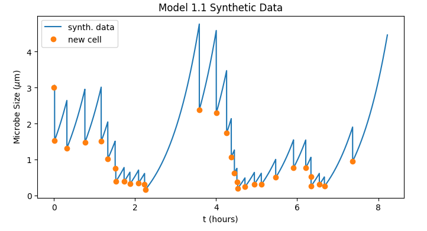

# 
 Microbial Growht :microbe:   Final project of Laboratory of Computational Physics - Mod. B 

**Group members:** Giovanni Zago, Emanuele Sarte, Alessio Saccomani, Fateme Baghaei Saryazdi  
**Supervisor:** Prof. Carlo Albert  
**Academic year:** 2022/2023

This project has been carried out by a group of Physics of Data student as final project of the course Laboratory of Computational Physics - Mod. B, held by Prof. Marco Baiesi. The subject of the project and the supervision of the work has been provided by Prof. Carlo Albert. 

## Table of contents
1. [Introduction](#introduction)
    1. [Formalism](#formalism)
    2. [Model 1](#model1)
    3. [Model 1.2](#model1.2)
    4. [Model 2](#model2)
    5. [Model 3](#model3)
    6. [Derivation of the PDFs](#pdfs)
2. [Synthetic data](#synthetic)
2. [Methods](#methods)
    1. [EnsembleSampler class](#ensemble)
    

## Introduction 

The aim of this project is analyzing data coming from microbial cultures by performing Bayesian inference of parameters belonging to stochastic models that describe the growth and the lifetime of the microbes themselves.

### Formalism 
The underlying idea that is shared by all the models considered for the analysis of the data is that a microbe can be described as a *dynamical system* characterized by a few dynamical variables $\vec{x}$ that obey a *"motion" equation*:

$$\dot{\vec{x}} = F(\vec{x}) \tag{1}$$

Clearly, both $\vec{x}$ and $F(\vec{x})$ are specified by the considered model, and thus can vary a lot. For example, a dynamical variable that is common to all the models is the *microbe size* $m$ (with $[m] = \Bbb{L}$), thus by solving eq. (1) one gets how the size of a microbe grows over time. Another importat aspect that must be embedded in a model is the lifetime of a microbe. As a matter of fact, it is evident that $m$ can not become arbitrairly large, since the microbe would divide at a certain moment, generating a daughter cell. However, it is reasonable to think that the time at which the microbe divides is not deterministic, and so its lifespan should be drawn from a *probability distribution*, that, again, can vary according to the considered model. The best way to formalize this is to define a function $S(t)$ called *survival probability* that represents the probability of the microbe cell to survive (i.e. not divide) for $\hat{t} \leq t$. In general the survival probability obeys

$$\frac{\dot{S}(t)}{S(t)} = - h(\vec{x}(t)) \tag{2}$$

where $h(\vec{x})$ is a generic function of the dynamic variables. Since $S(t)$ is a (sort of) cumulative distribudion function then $\dot{S}(t)$ is a probability distribution, and so $t \sim \dot{S}(t)$, with $t \geq 0$, represents, in theory, a possibile lifespan of the cell. This is a key concept because, for example, by collecting data samples of the microbes lifespans we can infer the parameters that describe $\dot{S}(t)$, which are also the parameters that describe $\vec{x}(t)$, allowing us to validate our models.  
Next we are going to showcase the models considered for the Bayesian inference through the project. 

### Model 1.1 
This first model is very basic and aims to get the essential features that a good model shoud embed to correctly describe the phenomenon we are facing. This model is single-traited, namely

$$\vec{x} \equiv x = m$$

with the microbe size $m$ obeying 

$$\dot{m} = \omega_1 (m + u) \tag{4}$$

In this case eq. (2) holds with

$$h(m) = \omega_2 \Big(1 + \frac{m}{v}\Big) \tag{5}$$

In these equations $\omega_1$ and $\omega_2$ represent two rates (*growth rate* and *division rate* respectively), so $[\omega_1] = [\omega_2] = \Bbb{T} ^ {-1}$ while $u, \, v$, with $[u] = [v] = \Bbb{L}$ represent two parameters that help the model to be more realistic. Another important feature that a model must provide is the conditional distibution that specifies how the microbe traits change after a division. In this model the distribution is

$$\mathcal{J}(m|m') = \delta \Big(m - \frac{m'}{2}\Big) \tag{6}$$

thus

$$m_{after} = \Braket{\mathcal{J}(m|m'), m} = \int m \, \delta \Big(m - \frac{m'}{2}\Big) dm = \frac{m'}{2}$$

By integrating eq. (4) we obtain

$$m(t) = e ^ {\omega_1 t} (m_0 + u) - u \tag{7}$$

that substituted in (5) returns

$$S(t) = \exp \Bigg(\omega_2 t \Big(\frac{u}{v} - 1\Big) - \frac{\omega_2 (m_0 + u)}{w_1 v} \Big(e^{\omega_1 t} - 1\Big)\Bigg) \tag{8}$$

### Model 1.2 
This model is a more accurate version of Model 1, since it embeds the fact that a microbe cell can divide only if a minimum size has been reached. Nevertheless, it is still a single trait model:

$$\vec{x} \equiv x = m$$

with the microbe size $m$ obeying

$$\dot{m} = \omega_1 m \tag{9}$$

Eq. (2) holds also in this case, but now

$$h(m) = \begin{cases} 0 \qquad \qquad m \lt u \\
\omega_2 \frac{m + v}{u + v} \qquad m \geq u\end{cases} \tag{10}$$

and also the expression for $\mathcal{J}(m|m')$ remains unchanged from Model 1. Eq. (9) leads to 

$$m(t) = m_0 e ^ {\omega_1 t} \tag{11}$$

and thus we can define the following quantity

$$\hat{t} \equiv \frac{1}{w_1} \log \Big(\frac{u}{m_0}\Big)$$

which represents the amount of time elapsed since the division of the mother cell in order for $h(m)$ to become non-zero. Now we can integrate eq. (), obtaining 

$$S(t) = 1 \qquad t \lt \hat{t} \tag{12a}$$

$$S(t) = \exp \Big(- \frac{\omega_2 m_0}{\omega_1(u+v)}[e ^ {\omega_1 t} - e ^ {\omega_1 \hat{t}} + \frac{\omega_1 v}{m_0} (t - \hat{t})]\Big) \qquad t \geq \hat{t} \tag{12b}$$

Since $m_0$ could be smaller than $u$, then, in those cases, $\hat{t} <0$, meaning that $h(m)$ is non-zero since the start of the daughter microbe's life and $S(t)$ has only the expression reported in eq. (12b). This means that $t=0$ is a valid sample from $\dot{S}(t)%$ and thus istantaneous division is allowed by this model. However, this feature is not realistic, because no obervations of this behaviour has been made on microbes. 

### Model 2 
Model 2 aims at correcting the istantaneous division problem that arises in Model 1.2. To do so we need to introduce another dynamic variable, $p$, which represents the amount of a fictious protein that needs to be accumulated over a certain threshold quantity in order to allow the division process. Thus in this case we have that

$$\vec{x} = \begin{pmatrix} m \\ 
p \end{pmatrix}$$

and

$$\dot{\vec{x}} = \begin{pmatrix} \omega_1 m \\ 
\omega_1 c m \end{pmatrix} \tag{13}$$

The growth rate $\omega_1$ is the same both for the size and the protein amount, which is a reasonable assumption. $c$ represents the protein concentration, which we can set equal to 1 without losing generality. The survival probability equation becomes

$$\frac{\dot{S}(t)}{S(t)} = - h(m,p) \tag{14}$$

with

$$h(m,p) = \begin{cases}0 \qquad \qquad \text{for} \quad p \lt u \\ 
\omega_2 \frac{p + v}{u + v} \qquad \text{for} \quad p \geq u\end{cases} \tag{15}$$

and the division equation becomes

$$\mathcal{J}(m,p | m',p') = \delta(p)\delta\Big(m - \frac{m'}{2}\Big) \tag{16}$$

meaning that the protein amount drops to zero at each cell division, while the microbe size after the division becomes half the one reached at the end of the previous life cycle. By integrating (3) we get

$$m(t) = m_0 e ^ {w_1 t} \tag{17}$$

$$p(t) = m_0 (e ^ {w_1 t} - 1) \tag{18}$$

Thanks to eq. (18) we can look at eq. (15) and define

$$\hat{t} \equiv \frac{1}{\omega_1} \log \Big(\frac{u}{m_0} + 1\Big) \tag{19}$$

which is always a positive quantity. Thus by integrating (15) we get

$$S(t) = 1 \qquad t \lt \hat{t} \tag{20a}$$

$$S(t) = \exp \bigg(- \frac{\omega_2 m_0}{\omega_1 (u + v)} \Big[e ^ {\omega _1 t} - e ^ {\omega _1 \hat{t}} + \omega_1 (t - \hat{t}) \Big(\frac{v}{m_0} - 1\Big)\Big]\bigg) \qquad t \geq \hat{t} \tag{20b}$$

from which it is evident that istantaneous division is not allowed. Next we report the plots of $S(t)$ and $\dot{S}(t)$ with example parameter values inferred from data.

### Model 3 

This last model is the more advanced one as it introduces more elements of stochasticity aiming at catching more accurately the observed behaviour of microbe cells. The fist main innovation that this model embeds is the presence of the growth rate as dynamic variable, thus

$$\vec{x} = \begin{pmatrix} m \\ 
p \\
\alpha \end{pmatrix}$$

with

$$\dot{\vec{x}} = \alpha \begin{pmatrix} m \\ 
c m \\
0 \end{pmatrix} \tag{21}$$

The survival probability equation remains the same as (15). So the growth rate does not vary during the lifetime of a microbe, but it may change from one cell cycle to the following. Indeed the division distribution embeds this feature, as well as a variable division factor:

$$\mathcal{J}(m, p, \alpha|m', p', \alpha') = f_{\Gamma}(\alpha) \, \delta(p) \, (f_{\beta} * \delta)(m) = $$

$$ = f_{\Gamma}(\alpha)  \delta(p) 
\int \delta(m - k m') f_{\beta}(k)  dk = f_{\Gamma}(\alpha) \delta(p) f_{\beta}\Big(\frac{m}{m'}\Big) \frac{1}{m'} \tag{22}$$

From eq. (22) we see that after each cell division the a growth rate $\alpha$ is drawn from a gamma distribution independently from the growth rate of the mother cell. Furthermore, we see that also the division rate $k$ is no longer fixed at $1/2$ but it is sampled from a beta distribution, making sure that $k \in (0,1)$. By integrating the previous equations we get

$$m(t) = m_0 e ^ {\alpha t} \tag{23}$$

$$p(t) = m_0 \big(e ^ {\alpha t} - 1\big) \tag{24}$$

As before, by looking at eq. (15), we can define

$$t ^ * \equiv \frac{1}{\alpha} \log\Big(\frac{u}{m_0} + 1\Big) \tag{25}$$

and then integrate (15), obtaining

$$S(t) = 1 \qquad t \lt \hat{t} \tag{26a}$$

$$S(t) = \exp \bigg(\frac{\omega_2}{(u+v)} [- \frac{m_0}{\alpha} \big(e ^ {\alpha t}-e^{\alpha \hat{t}}) + m_0 \big (t-\hat{t}) - v \big(t-\hat{t})]\bigg) \qquad t \geq \hat{t} \tag{26b}$$

The resulting pdf is:

$$p(t) = -S(t)\cdot \frac{\omega_2}{u+v} \cdot (-m_0 e^{\alpha t}+m_0-v) $$

### Derivation of the PDFs 

We are left with the derivation of the explicit formula of $p(\vec{x}_i|\vec{\theta})$ for each model, i.e. the PDF associated with the stochastic variables that characterize each model. From the previous sections we know that for models 1, 1.2 and 2 the only random variable is the lifespan $t$ of the microbe, and the probability distribution for $t$ is $p(t|\vec{\theta}) = -\dot{S}(t)$, where the minus sign is due to the fact that $S(t)$ is a survival probability and so dispalys a monothonic decreasing behaviour as a function of $t$. Equation (2) helps calculating $p(t|\vec{\theta})$ easily, since $p(t|\vec{\theta}) = h(t) \cdot S(t)$, but a little rearrangement is needed to then take its logarithm in a more clever way.  

For model 1.2 we get:
$$p(t|\vec{\theta}) = 0 \qquad t \lt \hat{t}$$

$$p(t|\vec{\theta}) = \frac{\omega _2 m_0}{\omega _1 (u + v)} \exp \Bigg(- \frac{\omega _2 m_0}{\omega _1 (u + v)} \Big[e ^ {\omega _1 t} - e ^ {\omega _1 \hat{t}}+ \frac{\omega _1 v}{m_0} (t - \hat{t}) \Big]\Bigg) \cdot$$

$$\cdot \Bigg(\omega _1 e ^ {\omega _1 t} +  \frac{\omega _1 v}{m_0}\Bigg) \qquad t \geq \hat{t}$$

For model 2 we get:

$$p(t|\vec{\theta}) = 0 \qquad t \lt \hat{t}$$

$$p(t|\vec{\theta}) = \frac{\omega _2 m_0}{\omega _1 (u + v)} \exp \Bigg(- \frac{\omega _2 m_0}{\omega _1 (u + v)} \Big[e ^ {\omega _1 t} + \omega _1 (t - \hat{t}) \Big(\frac{v}{m_0} - 1\Big) - \frac{u}{m_0} - 1\Big]\Bigg) \cdot$$

$$\cdot \Bigg(\omega _1 e ^ {\omega _1 t} + \omega _1 \Big(\frac{v}{m_0} - 1\Big)\Bigg) \qquad t \geq \hat{t}$$

When dealing with model 3, instead, the situation is slightly more complicated since the stochastic variable is no longer only $t$, but also the growth rate $\alpha$ and the division rate $k$. This means that rather than having a univariate PDF we have a joint PDF:

$$p(t,\alpha, k|\vec{\theta}) =  p(t|\alpha, k, \vec{\theta}) \cdot p(k|\vec{\theta}) \cdot p(\alpha|\vec{\theta}) =  $$

$$ = p(t|\alpha, k, u, v, \omega_2) \cdot \text{Gamma}(\alpha|a,b) \cdot \text{Beta}(k|c,d)$$

This factorization reflects the fact that the PDF for $t$ depends also on the random variables $\alpha$ and $k$ while the PDFs for $\alpha$ and $k$ are independent and so $p(\alpha|k, \vec{\theta})$ factorizes directly into a Gamma and Beta distributions, with parameters respectively $(\text{shape}, \text{scale}) = (a,b)$ and $(\text{shape1}, \text{shape2}) = (c,d)$.

## Synthetic data 
Now that we have fully outlined the main characteristics of our models it is possible to go through a preliminary phase in which we study synthetic, i.e. simulated, data. This helps catching better the behaviour of the models and also paves the way to performing the actual inference. A synthetic dataset for each model can be easily obtained by collecting random samples from the probability distributions derived in the previous section. The fact that we also know their cumulative distributions makes the task easier, since plain Monte Carlo sampling with numerical inversion will suffice. For model 1, 1.2 and 2 the only stochastic variable is the division time $t$ and so a synthetic dataset consists in a collection $\lbrace t_i\rbrace _{i = 1...n}$ where $t_i \sim -\dot{S}(t) \text{ } \forall i$. In model 3 instead we have three stochastic variables, so a synthetic dataset will be a collection of tuples $\lbrace (t, \alpha, k) _i\rbrace _{i=1...n}$ with $(t, \alpha, k)_i \sim p(t, \alpha, k|\vec{\theta}) \text{ } \forall i$. In the following we report the plots of synthetic lineages for each model

    <!-- -->
    
    
    
    <!--  -->
    
    

## Methods 

As previously stated, our goal is use the proposed datasets to estimate the parameters of the aforementioned models exploiting Bayesian inference. In other words our target is sampling the multivariate *posterior* distribution of the parameters, given by the Bayes theorem

$$f(\vec{\theta}|\{\vec{x}_i\}) \propto P(\{\vec{x}_i\}|\vec{\theta}) \cdot p(\vec{\theta})$$

The tool exploited for sampling the posterior is  [``emcee``](https://emcee.readthedocs.io/en/stable/), a open source python-based *Affine Invariant* Markov chain Monte Carlo (MCMC) Ensemble sampler.

### ``EnsembleSampler`` class 
The key class of the ``emcee`` library is [``EnsembleSampler``](https://emcee.readthedocs.io/en/stable/user/sampler/), whose constructor creates an ``EnsembleSampler`` object. To do so, in our case, it is important to specify:
- ``nwalkers``, the number of walkers that will move through the parameter space in order to sample from the posterior
- ``ndim``, the dimension of the parameter space on which the posterior is defined
- ``log_prob_fn``, a function that takes as input a vector of parameters belonging to the parameter space and returns the natural logarithm of the unnormalized posterior distribution
- ``args``, an additional set of parameters that is required for the calculation of ``log_prob_fn``. In our case, ``args`` represents the data $\{\vec{x}_i\}$.

It is evident that the most challenging part is the calculation of ``log_prob_fn``, since it requires first the computation of $P(\{\vec{x}_i\}|\vec{\theta})$, which is the likelihood function. The likelihood requires in turn the PDF function $p(\vec{x}_i|\vec{\theta})$, which we have derived before. Indeed, assuming independent measurements $\{\vec{x}_i\}$ we have that

$$P(\{\vec{x}_i\}|\vec{\theta}) = \prod _{i = 1}^{n} p(\vec{x}_i|\vec{\theta})$$

but since we need to provide the natural logarithm of the posterior, we should focus on the log-likelihood:

$$\log P(\{\vec{x}_i\}|\vec{\theta}) = \sum _{i = 1}^{n} \log p(\vec{x}_i|\vec{\theta})$$

As prior $p(\vec{\theta})$ we have chosen a uniform distribution and taken its natural logarithm:

$$\log p(\vec{\theta}) = \begin{cases} 0 \qquad \text{if} \quad \vec{\theta} \in A \\
-\infty \quad \text{otherwise}\end{cases} \qquad \text{with} \quad A \subseteq \mathbf{R}^d$$

So the whole unnormalized log-posterior is 

$$
\log f(\vec{\theta}|\{\vec{x}_i\}) = \sum _{i = 1}^{n} \log p(\vec{x}_i|\vec{\theta}) + \log p(\vec{\theta})
$$

### Inference on synthetic data 
In order to become proficient in the use of ``EnsambleSampler`` we first exploited it to infer the model parameters from the synthetic data. This is useful since we can have a solid grasp in the outcome, and so it is possible to fix bugs and errors easily. Once this step is properly completed, switching to real data is straigthforward since the code is already implemented. Once we have instantiated the ``EnsambleSampler`` method we can use its ``run_mcmc`` method to generate the chain of the samples of the posterior. In the following we report the chains and the plots of the marginalized posterior for each parameter. 

### Inference on real data 
Once made sure that the inference worked well on synthetic data we switched to considering real data. The datasets used in this work are [*Tanouchi25c*](https://doi.org/10.1038/sdata.2017.36), [*Tanouchi37c*](https://doi.org/10.1038/sdata.2017.36) and [*Susman18*](https://www.pnas.org/doi/full/10.1073/pnas.1615526115). These datasets contain long-term, single-cell measurements of *Escherichia coli* cultures grown in different conditions. Each record contains ready-to-use values on the initial length, final length, lifespan, growth rate and division ratio of the microbe. Records are organized into *lineages*, namely groups of records associated to cells that share the same parent. This is an important detail because in order to keep track of the aforementioned quantities we have to make sure that they refer to the same lineage. Thus we have performed the inference lineage by lineage.